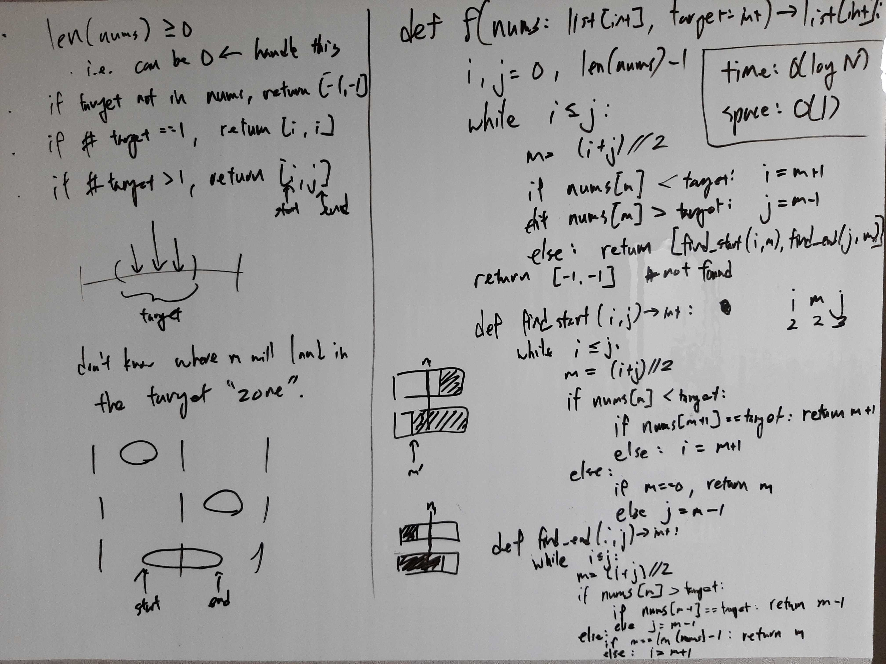

[Problem](https://leetcode.com/problems/find-first-and-last-position-of-element-in-sorted-array/)

## Algorithm Classification
- Binary Search

## Takeaways
- Differences between:
    - `i <= j`  vs `i < j`
        - With i < j, we can guarantee:
            - m < j, if m = (i + j) // 2
            - m > i, if m = (i + j + 1) // 2
        - Use i < j if we want to use the above property.
    - `i = m + 1` vs `i = m` and `j = m - 1` vs `j = m`
        1. Consider if it is ok to "skip" m or not.
        2. Consier proper loop termination.
            - e.g. if m == j, then j = m might result in a infinite loop.

## Take 1
- Approach
    - If target is found in nums, it must the case that:
        - the index of the first ocurrence of the target between i and m.
        - the index of the last ocurrence of the target between m and j.


- Code
```python
def searchRange(self, nums: List[int], target: int) -> List[int]:
    def find_start(i, j) -> int:
        while i < j:
            m = (i + j) // 2
            if nums[m] < target:
                if nums[m + 1] == target:  # m < j always true, so safe
                    return m + 1
                else:
                    i = m + 1
            else:  # nums[m] == target; nums > target won't happen
                if m == i:
                    return m
                else:
                    j = m  # don't skip m, since m could be the start index
        return i

    def find_end(i, j) -> int:
        while i < j:
            m = (i + j + 1) // 2  # ceiling division, not floor division
            if nums[m] > target:
                if nums[m - 1] == target:  # m > i always true, so safe
                    return m - 1
                else:
                    j = m - 1
            else:  # nums[m] == target; nums < target won't happen
                if m == j:
                    return m
                else:
                    i = m  # don't skip m, since m could be the end index
        return i

    i, j = 0, len(nums) - 1
    while i <= j:
        m = (i + j) // 2
        n = nums[m]
        if n < target:
            i = m + 1
        elif n > target:
            j = m - 1
        else:
            return [find_start(i, m), find_end(m, j)]
    return [-1, -1]
```
- Time: O(log N)
- Space: O(1)
- Result: Accepted

