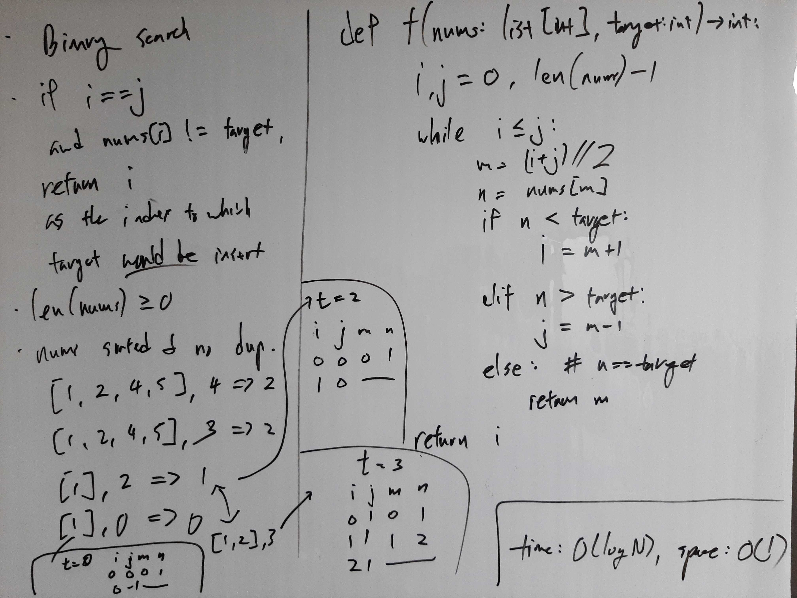

[Problem](https://leetcode.com/problems/search-insert-position/)

## Algorithm Classification
- Binary Search

## Takeaways
- Carefully verify the algorithm with test cases, paying special attention to
  the edge cases.

## Take 1
- Approach
    - If the while loop terminates, return i, as i is the index where target
      would be inserted to. This is true because in the last iteration where i
      == j, m == i and n == nums[i]:
        - if target < n, i doesn't change, which is correct.
        - if target > n, i += 1, which is also correct.


- Code
```python
def searchInsert(self, nums: List[int], target: int) -> int:
    i, j = 0, len(nums) - 1
    while i <= j:
        m = (i + j) // 2
        n = nums[m]
        if target < n:
            j = m - 1
        elif target > n:
            i = m + 1
        else:  # n == target
            return m
    return i
```
- Time: O(log N)
- Space: O(1)
- Result: Accepted

