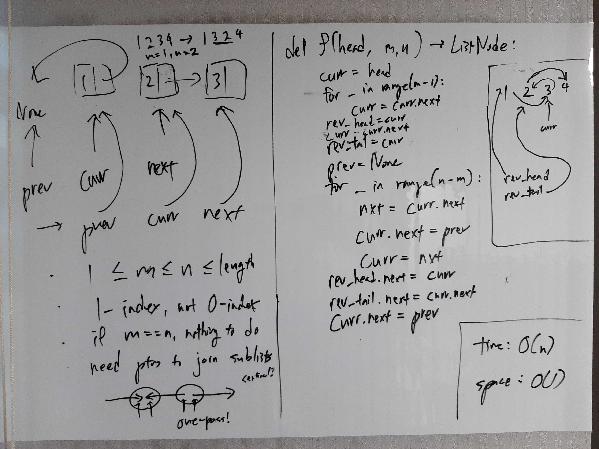

[Problem](https://leetcode.com/problems/reverse-linked-list-ii/)

## Algorithm Classification
- Linked List

## Takeaways
- Using a sentinel node is almost always a good idea with linked lists. Even if
  you're not sure you're going to need it, just create one. Even if it isn't
  used, it doesn't hurt time or space complexity and can be removed with little
  effort.

## Take 1
- Approach
    - If m == n, no reversing happens, so just return the head.
    - We have to join the pre-reverse, reversed, post-reverse linked lists
      together and return the head of the pre-reverse linked list.
    - However, in the case of m == 1, there is no pre-reverse linked list, so
      there is no head to return; use a sentinel node to handle this.
    - Node at index m - 1 should point to node at index n, so store it as the
      pre-head of the reversed linked list.
    - Node at index m should point to node at index n + 1, so store it as
      the tail of the reversed linked list.
    - Reverse as usual and join all the lists using the pointers stored above.

- Code
```python
def reverseBetween(self, head: ListNode, m: int, n: int) -> ListNode:
    if m == n:
        return head

    sentinel = ListNode()
    sentinel.next = head

    curr = sentinel
    for _ in range(m - 1):
        curr = curr.next
    rev_head = curr
    curr = curr.next
    rev_tail = curr

    prev = None
    for _ in range(n - m):
        nxt = curr.next
        curr.next = prev
        prev = curr
        curr = nxt

    rev_head.next = curr
    rev_tail.next = curr.next
    curr.next = prev

    return sentinel.next
```
- Time: O(n)
    - Note that the time complexity is not O(N), where N is the length of the
      original list, but rather O(n), because the algorithm terminates at index
      n.
- Space: O(1)
- Result: Accepted

