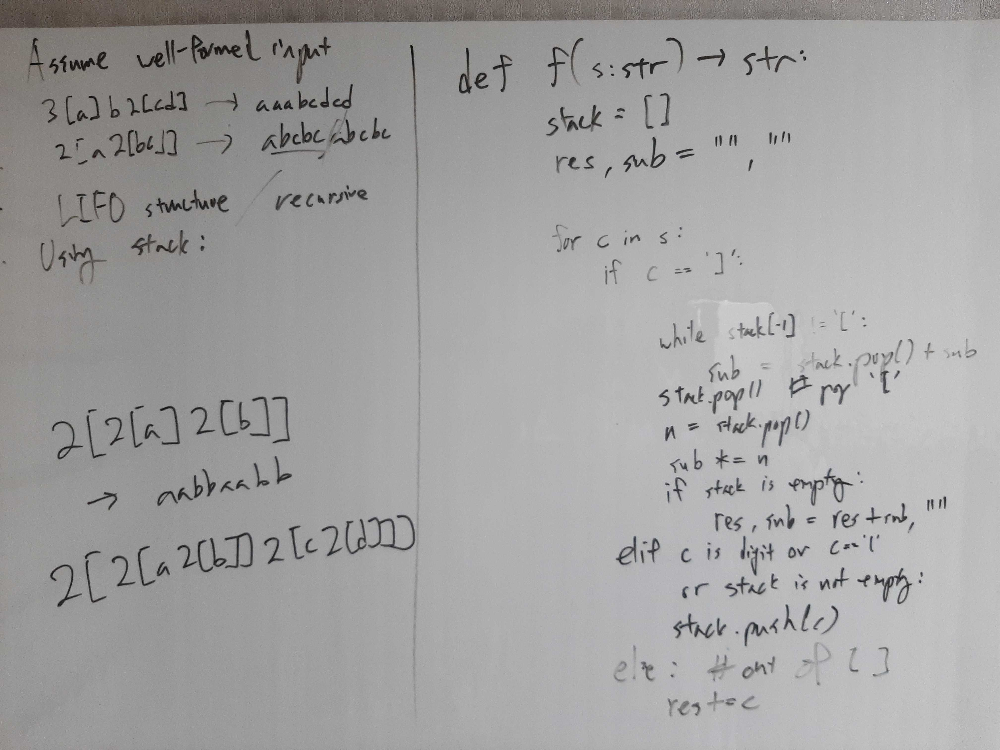

[Problem](https://leetcode.com/problems/decode-string/)

## Algorithm Classification
- Stack

## Take 1
- Approach
    - Iterative solution using a stack.


- Code
```python
def decodeString(self, s: str) -> str:
    stack = []

    for c in s:
        if c == ']':
            sub = ""
            while stack[-1] != '[':
                sub = stack.pop() + sub
            stack.pop()  # discard '['

            n = ''
            while stack and stack[-1].isdigit():
                n = stack.pop() + n
            n = int(n)
            sub *= n

            for sc in sub:
                stack.append(sc)
        else:
            stack.append(c)

    return ''.join(stack)
```
- Time: O(N + M)
    - N := length of the input string
    - M := length of the output string
- Space: O(M)
    - M := length of the output string
- Result: Accepted

