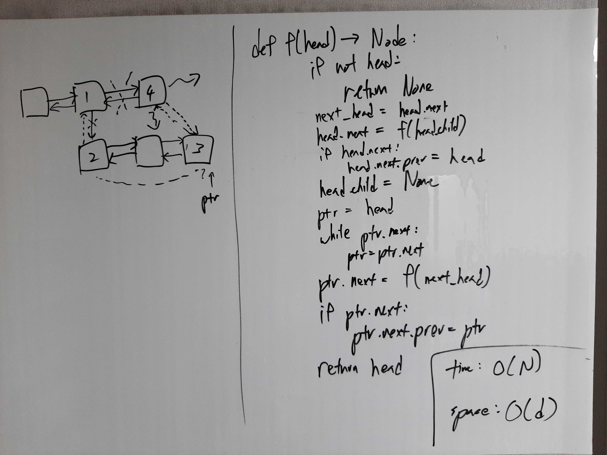

[Problem](https://leetcode.com/problems/flatten-a-multilevel-doubly-linked-list/)

## Algorithm Classification
- Linked List
- DFS

## Takeaways
- Look for familiar data structure / algorithm in disguise.

## Take 1
- Approach
    - f(head) = head + f(head.child) + f(head.next)

- Code
```python
def flatten(self, head: 'Node') -> 'Node':
    if not head:
        return None

    next_head = head.next

    head.next = self.flatten(head.child)
    if head.next:
        head.next.prev = head
    head.child = None

    ptr = head
    while ptr.next:
        ptr = ptr.next

    ptr.next = self.flatten(next_head)
    if ptr.next:
        ptr.next.prev = ptr

    return head
```
- Time: O(N)
    - Two pass because of tail tracking.
- Space: O(d)
    - where d := max recursion depth.
    - If the entire list is joined by child link, can grow up to O(N).
- Result: Accepted

## Take 2
- Approach
    - This multilevel doubly linked list really is just a tree.
    - Do preorder traversal.
    - Avoid two pass by returning the tail of a sublist and joining every pair
      of nodes we encounter.
- Code
```python
def flatten(self, head: 'Node') -> 'Node':
    def dfs(prev: Node, curr: Node) -> Node:
        prev.next = curr
        curr.prev = prev

        tail = curr
        tmp = curr.next
        if curr.child:
            tail = dfs(curr, curr.child)
            curr.child = None
        if tmp:
            tail = dfs(tail, tmp)
        return tail

    if not head:
        return None

    sentinel = Node(None, None, None, None)
    dfs(sentinel, head)
    sentinel.next.prev = None

    return sentinel.next
```
- Time: O(N)
    - One pass!
- Space: O(d)
    - where d := max recursion depth.
    - If the entire list is joined by child link, can grow up to O(N).
- Result: Accepted

