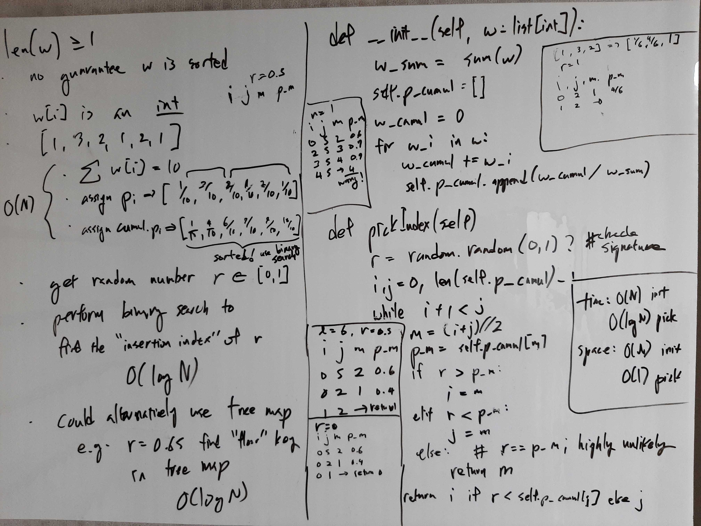

[Problem](https://leetcode.com/problems/random-pick-with-weight/)

## Algorithm Classification
- Binary Search

## Takeaways
- If we want to find the smallest interval [i, j] in which the target falls
  into:
    - `i, j = -1, len(l)`
        - Handle the cases when target is smaller than the first element or
          when target is greater than the last element.
    - `while i + 1 < j`
        - If i + 1 == j, we are at the smallest possible interval, so
          terminate.
    - `i = m` and `j = m`
        - Since we are dealing with intervals, incorrect to skip m.
        - Because of the looping contidion i + 1 < j, m = (i + j) // 2 is never
          equal to i or j, so the loop will terminate properly.

## Take 1
- Approach
    - Make a list of cumulative probabilities, and do a binary search with a
      randomly generated number.


- Code
```python
class Solution:

    def __init__(self, w: List[int]):
        w_sum = sum(w)
        self.p_cumul = []
        w_cumul = 0
        for w_i in w:
            w_cumul += w_i
            self.p_cumul.append(w_cumul / w_sum)

    def pickIndex(self) -> int:
        r = random.uniform(0, 1)  # inclusive upper bound
        i, j = -1, len(self.p_cumul)
        while i + 1 < j:
            m = (i + j) // 2
            p_m = self.p_cumul[m]
            if r > p_m:
                i = m
            elif r < p_m:
                j = m
            else:  # r == p_m; highly unlikely
                return m
        return j
```
- Time: O(N) for init, O(log N) for pickIndex
- Space: O(N) for init, O(1) for pickIndex
- Result: Accepted

