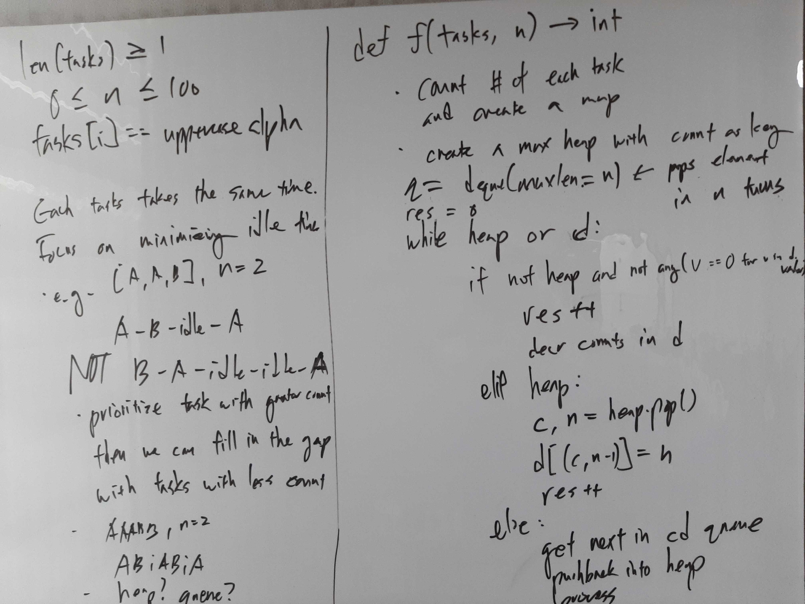

[Problem](https://leetcode.com/problems/task-scheduler/)

## Algorithm Classification
- Queue
- Heap
- Greedy

## Take 1
- Approach
    - Create a cooldown queue where characters are removed from seletion for n
      iterations.
    - Character with greater count should be processed first, because:
        - A B . A vs B A . . A
        - Use a max heap to get the character with the biggest remaining count.


- Code
```python
class Solution:
    def leastInterval(self, tasks: List[str], n: int) -> int:
        if n == 0:
            return len(tasks)

        cnt = Counter(tasks)
        heap = [(-v, k) for k, v in cnt.items()]  # max heap
        heapify(heap)
        q = CDQ(n)

        time = 0
        while heap or not q.empty():
            next_ = None
            if heap:
                cnt, task = heappop(heap)
                cnt += 1  # max heap, so "decrement" count by adding 1
                if cnt < 0:  # if cnt == 0, done
                    next_ = (cnt, task)
            res = q.update(next_)
            if res:  # non-None element is off cooldown now
                heappush(heap, res)
            time += 1

        return time

class CDQ:
    """Cooldown Queue"""

    def __init__(self, n):
        self.q = deque()
        for _ in range(n):
            self.q.appendleft(None)
        self.size = 0

    def update(self, e=None):
        if e:
            self.size += 1
        self.q.appendleft(e)

        res = self.q.pop()
        if res:
            self.size -= 1
        return res

    def empty(self):
        return self.size == 0
```
- Time: O(N)
    - O(N) to count up.
    - Size of the resulting heap is at most 26, i.e. O(1), so all the
      operations on it are O(1) as well.
    - Size of the queue is O(n), but is not processed more than O(N) times.
- Space: O(n)
    - Size of the resulting heap is at most 26, i.e. O(1).
    - Size of the queue is O(n) big.
- Result: Accepted

## Take 2
- Approach
    - Observe that there at most n * (max_cnt - 1) idle time slots.
        - e.g. if n = 2 and max_cnt = 3, then 4 idle slots: A . . A . . A
    - For each count in list, fill up at most (max_cnt - 1) idle time slots,
      e.g. A B . A B . A B fills up 2 slots although there are 3 Bs.
    - Make sure that idle time is not negative, which can happen in the loop:
        - A . . A . . A . . A
        - A B . A B . A B . A
        - A B . A B C A B C A: fill up from the right for correctness.
            - e.g. A B C A B C A B **D** A **D** is invalid.
            - For the purpose of counting, doesn't matter.
        - A B D A B C A B C A D: idle_time drops from 1 to -1.

- Code
```python
def leastInterval(self, tasks: List[str], n: int) -> int:
    total_cnt = len(tasks)
    if n == 0:
        return total_cnt

    cnt = Counter(tasks)
    l = list(cnt.values())
    l.sort()

    max_cnt = l.pop()
    idle_time = n * (max_cnt - 1)  # e.g. A . . A . . A for max_cnt = 3 and n = 2
    while l and idle_time > 0:
        curr = l.pop()
        idle_time -= min(curr, (max_cnt - 1))  # e.g. A B . A B . A B
    idle_time = max(0, idle_time)  # idle time cannot be negative
    return total_cnt + idle_time
```
- Time: O(N)
    - O(N) to count up.
    - Resulting frequency list is only 26 elements long, so O(1)
- Space: O(1)
    - Resulting frequency list is only 26 elements long, so O(1)
- Result: Accepted

