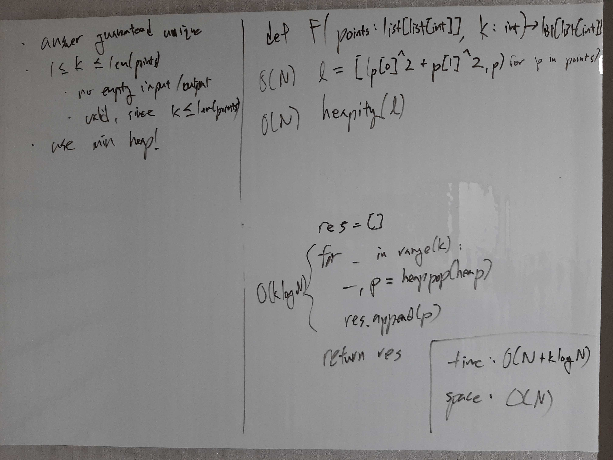

[Problem](https://leetcode.com/problems/k-closest-points-to-origin/)

## Algorithm Classification
- Heap

## Takeaways
- heapify takes O(N) time vs. N heappush calls takes O(N log N) time.

## Take 1
- Approach
    - Use min heap with Euclidean distance of a point to the origin as key.


- Code
```python
def kClosest(self, points: List[List[int]], K: int) -> List[List[int]]:
    l = [(math.sqrt(math.pow(p[0], 2) + math.pow(p[1], 2)), p) for p in points]
    heapq.heapify(l)
    res = []
    for _ in range(K):
        _, p = heapq.heappop(l)
        res.append(p)
    return res
```
- Time: O(N + k log N)
    - O(N) for heapify.
    - O(k log N) for k heappop.
- Space: O(N)
    - O(N) for the heap.
- Result: Accepted

