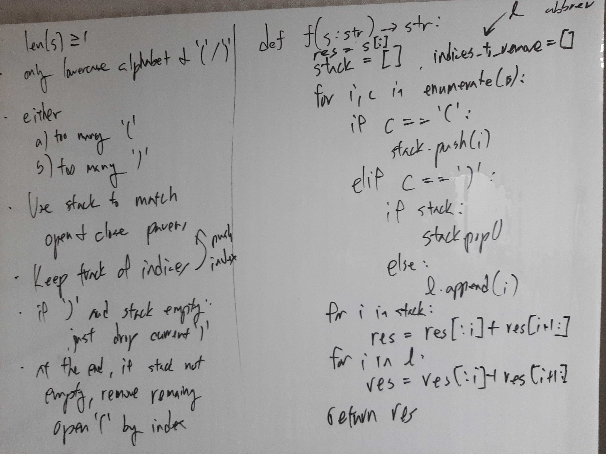

[Problem](https://leetcode.com/problems/minimum-remove-to-make-valid-parentheses/)

## Algorithm Classification
- Stack

## Takeaways
- Always consider using the indices of target characters in strings, as opposed
  to the characters themselves.

## Take 1
- Approach
    - Use a stack to match opening and closing parentheses.
    - Mark indices to remove using a stack and a list, where the stack keeps
      track of opening parentheses and the list keeps track of closing
      parenthesea.


- Code
```python
def minRemoveToMakeValid(self, s: str) -> str:
    res = s[:]
    stack, l = [], []
    for i, c in enumerate(s):
        if c == '(':
            stack.append(i)
        elif c == ')':
            if stack:
                stack.pop()
            else:
                l.append(i)
    # In the end, the possible cases are:
    # 1. both stack and list are empty
    # 2. only the stack is empty
    # 3. only the list is empty
    # 4. both are not empty
    #
    # Note that we want to remove characters at greater indices first,
    # because given i, j where i < j, if  s[i] is removed before s[j],
    # then s[j] != modified_s[j]. So we should process these indices
    # in LIFO order, or just reverse order.
    #
    # Cases 1-3 are simple, but the last one needs a special attention.
    # Observe that the indices remaining in the stack must be greater than
    # those in the list because indices are inserted into the list only
    # when the stack is empty, meaning that the ones remaining in the stack
    # were pushed after a smaller index was inserted into the list, so we
    # need to process the indices in the stack first then process the list.
    for i in reversed(stack):
        res = res[:i] + res[i + 1:]
    for i in reversed(l):
        res = res[:i] + res[i + 1:]

    return res
```
- Time: O(MN)
    - N := length of the input string.
    - M := # of mismatched parentheses.
    - Scanning the string to find mismatched parentheses takes O(N) time.
    - Slicing to remove M characters from a string of length N takes O(MN)
      time.
- Space: O(M)
    - M := # of mismatched parentheses.
- Result: Accepted

## Take 2
- Approach
    - Instead of slicing to remove characters from the original string, which
      takes O(MN) time, build a string excluding characters from those indices.

- Code
```python
def minRemoveToMakeValid(self, s: str) -> str:
    stack, set_ = [], set()
    for i, c in enumerate(s):
        if c == '(':
            stack.append(i)
        elif c == ')':
            if stack:
                stack.pop()
            else:
                set_.add(i)

    set_ |= set(stack)
    res = []
    for i, c in enumerate(s):
        if i not in set_:
            res.append(c)
    return ''.join(res)
```
- Time: O(N)
    - N := length of the input string.
    - Scanning the string to find mismatched parentheses takes O(N) time.
    - Building the result string with indices also takes O(N) time.
    - However, take 1 performs much faster on Leetcode due to constant factors.
- Space: O(M)
    - M := # of mismatched parentheses.
- Result: Accepted

