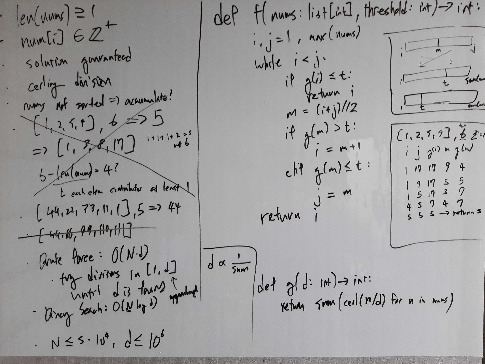

[Problem](https://leetcode.com/problems/find-the-smallest-divisor-given-a-threshold/)

## Algorithm Classification
- Binary Search

## Takeaways
- Generalize binary search problems into the following: find the smallest index
  k such that a predicate is satisfied.
    ```python
    def lower_bound(l, i, j, predicate):
        while i < j:
            m = (i + j) // 2
            if predicate(m):
                j = m
            else:
                i = m + 1
        return i
    ```
    - This template simplifies indexing logic and handle duplicates elegantly.
    - Since i < j and m = (i + j) // 2, m is always strictly less than j,
      whereas i == m if i + 1 == j, and this lines up nicely with how the
      indices are updated so that the loop always terminates properly.
    - e.g. find the smallest divisor such that the sum of the quotients rounded
      up is less than or equal to a threshold.
    - e.g. basic binary search -> find the first index where the value at index
      is greater than or equal to the target.
        - if checking for presence, return l[i] == target.
        - if computing insetion index, start with j = len(l) as opposed to
          len(l) - 1 and return i (or -i - 1).
    - e.g. find the index of the last occurrence of n -> find the index of the
      first occurrence of n + 1, and then subtract 1 to find the last index.
    - e.g. given a list of cumulative probabilities, find the interval where a
      random probability r falls into -> find the smallest index k such that
      r is strictly less than probs[k].

## Take 1
- Approach
    - If threshold == len(nums), we need divisor == max(nums), so divisor can
      range from 1 to max(nums).
    - Perform a binary search in [1, max(nums)].


- Code
```python
def smallestDivisor(self, nums: List[int], threshold: int) -> int:
    def sum_ceil_quot(d: int) -> int:
        return sum(ceil(n / d) for n in nums)

    i, j = 1, max(nums)
    while i < j:
        m = (i + j) // 2
        res = sum_ceil_quot(m)
        if res > threshold:
            i = m + 1  # safe to skip; also needed for proper termination
        elif res <= threshold:
            j = m  # sum_ceil_quot(m - 1) > threshold possible; don't skip
    return i
```
- Time: O(N log M)
    - M := max(nums)
- Space: O(1)
- Result: Accepted

## Take 2
- Approach
    - Generalize binary search problems into the following: find the smallest
      index k such that a predicate is satisfied.
    - For this problem specifically, find the smallest divisor such that the
      sum of the quotients rounded up is less than or equal to a threshold.

- Code
```python
def smallestDivisor(self, nums: List[int], threshold: int) -> int:
    def predicate(divisor: int) -> bool:
        return sum(ceil(n / divisor) for n in nums) <= threshold

    return self.lower_bound(nums, 1, max(nums), predicate)

def lower_bound(self, l, i, j, predicate):
    while i < j:
        m = (i + j) // 2
        if predicate(divisor=m):
            j = m
        else:
            i = m + 1
    return i
```
- Time: O(N log M)
    - M := max(nums)
- Space: O(1)
- Result: Accepted

